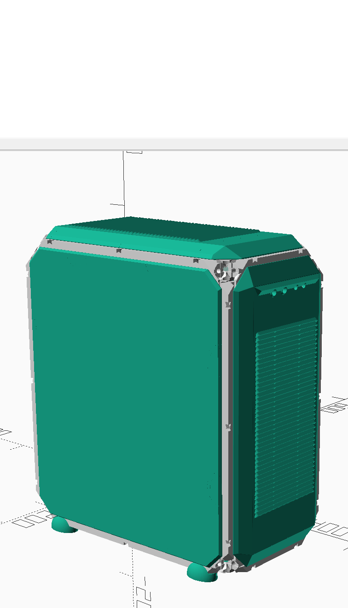
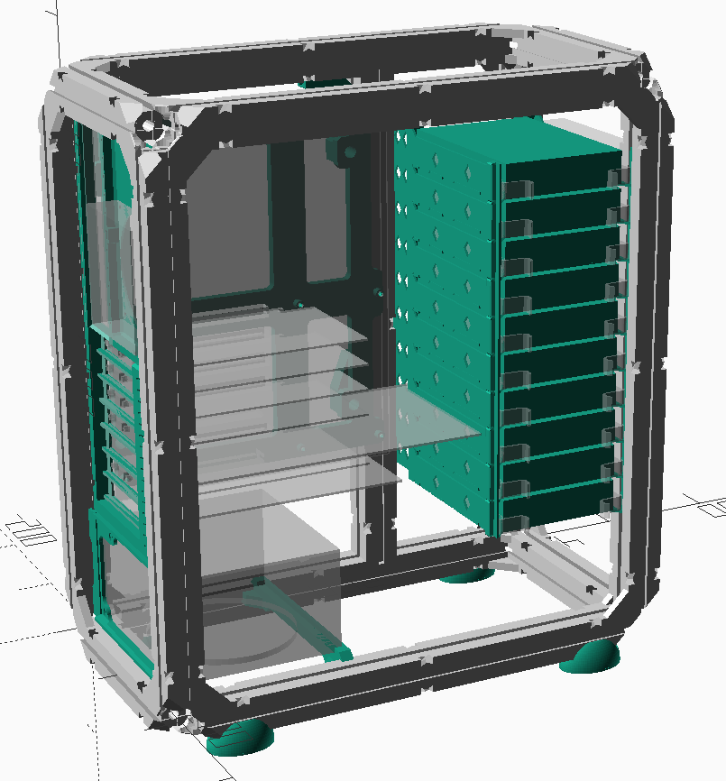
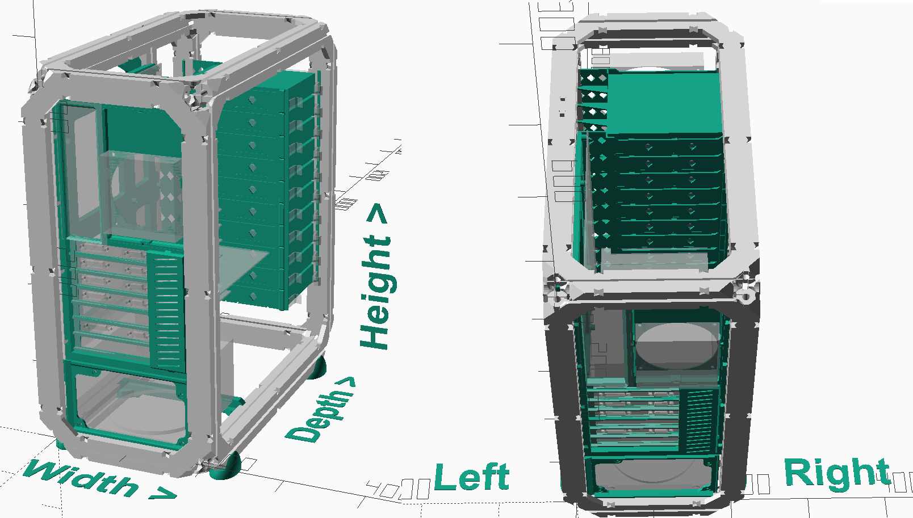
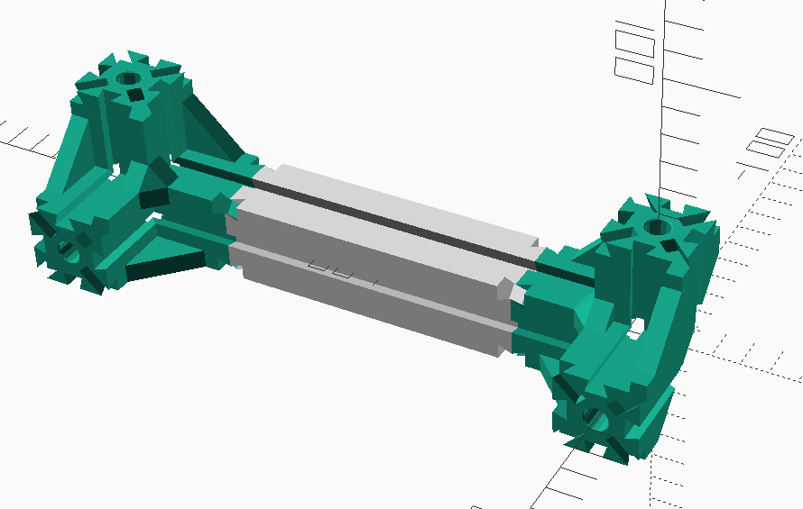
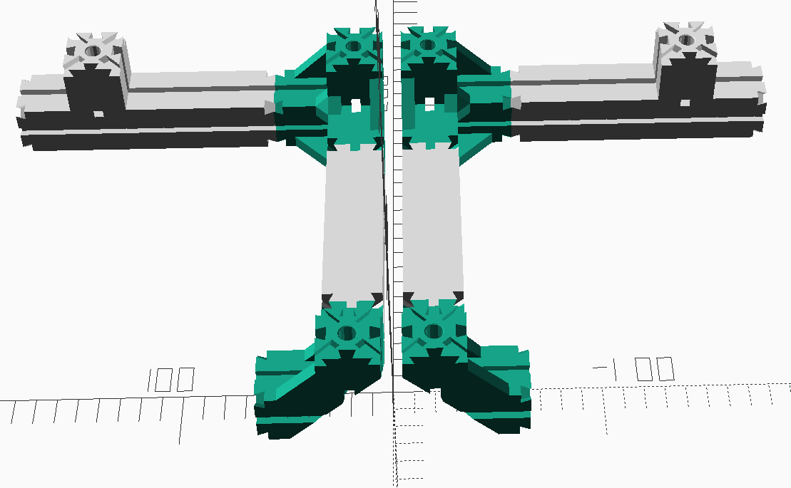
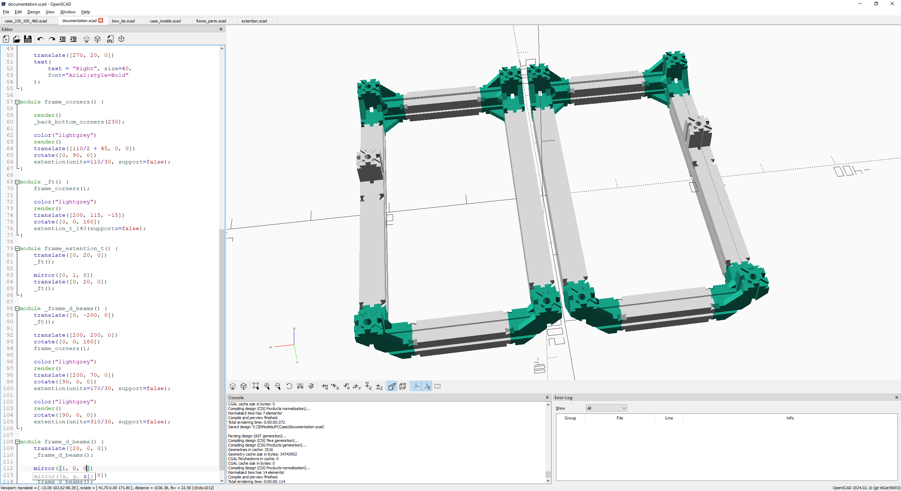
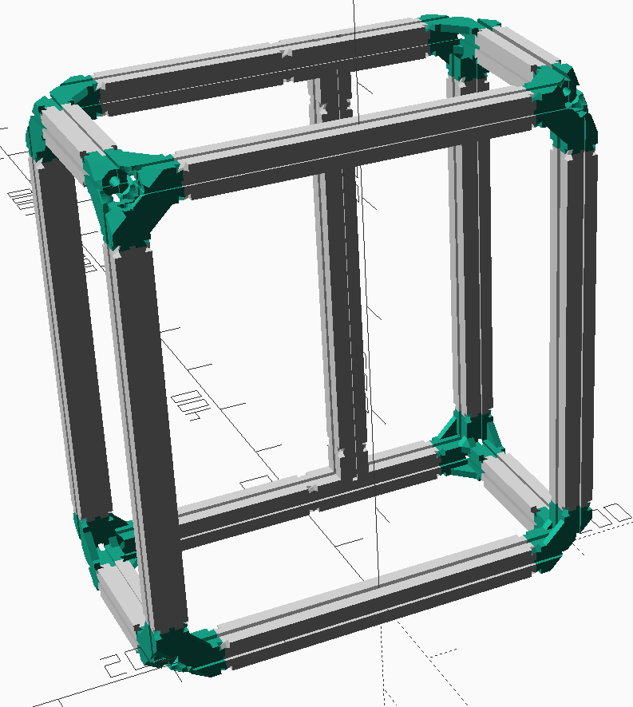
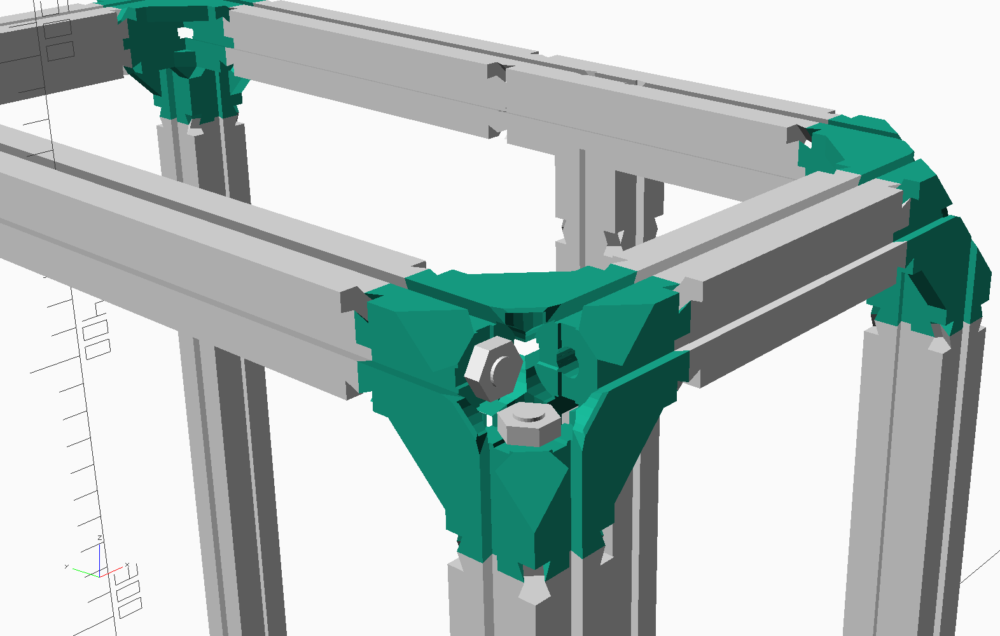

# 3D printed PC case, customizable

This is a mostly 3D printed PC case, modeled in OpenSCAD. The frame is built using [Dollo3D](https://reprap.org/wiki/Dollo) 'extention' pieces which allows for quite easy size customization. Current parts from my Dollo3D fork: https://github.com/spegelius/Dollo.

The project is quite big one so it takes time and material to build. Currently made for ATX and EE-ATX form factor (and one custom Raspberry Pi NAS/Chia mining case which is a separate project using this as base).

## Dimensions
Dimensions and orientation is shown in following picture. Parts specific for certain case size use WxDxH-notation and when certain dimension doesn't matter (for example motherboard back plate doesn't care about depth), the dimension is omitted (WxH motherboard back plate example).

## Sizes
Note that the 30x30mm Dollo3D frame pieces makes the  case bit bigger than regular case would be.

Currently following sizes are implemented:
- 230x430x480: ATX case, probably the smallest possible ATX case to build.
- 230x500x520: ATX case, has extra room for watercooling radiator (360).
- 240x540x525: EE-ATX case for SuperMicro server motherboard. Not sure if the EE-ATX spec is a standard...
- 240x540x550: EE-ATX case for SuperMicro server motherboard. Not sure if the EE-ATX spec is a standard...

Other sizes:
- 315x520x520: WIP ATX case, intended to house 2x360 radiators. No ETA if this will become reality ever...
- 218x400x400: special case made for Raspberry Pi NAS/Chia mining. Full Implemented in spearate project.

### Size customization
To create a case with size not listed above, the easiest way is to contact me. However, creating the size specific parts is quite straightforward, but does require some OpenSCAD experience.

I recommend copying one of the case_WxDxH.scad files and modifying the dimensions there to see how it works out.
Use following files to check and generate needed files:
- cover.scad
- motherboard.scad
- fans.scad
- hdd.scad
- motherboard.scad
- psu.scad

## Printing the parts
Since Dollo3D parts use dovetail joints to attach parts together, accurate printer is practically a must. I've printed most of the parts with my Prusa MK2.5S and default PrusaSlicer profiles and all parts fit together without too much hassle.
Printing and assembling the frame should be a good test about the quality. More about this in frame build section.

### Materials to use
I have printed 5 cases and used:
- PLA for the frame
- PETG for motherboard tray and tray mounts
- PETG for the hdd mounts
- GreenTec Pro for motherboard back plate
- PLA for covers
- PLA and FlexFill 98 for feet
But these are just what I've used. AFAIK PLA does deform more than other materials so it might be better to use PETG or other stronger material for structural parts.

## Build instructions

At this point you'll need to know what size you want to build.

### Frame
Frame consists of corners and W-, D- and H-beams. Each corner part is 60mm in each dimension, so when calculating the beam lenghts and what extentions to print, deduct 120mm from the total length.
Parts are joined with bow ties and you'll need to print quite a lot of those. There's a bow_tie plate model with 20 pieces available.

### Frame: corners and W beams
Parts to print:
- 8 x frame_STL/corner.stl or frame_STL/corner_no_supports.stl
- 4 x frame_STL/extention_x.stl. The extention lenght depends of the case width; for example 230mm - 120 mm = extention_110.stl
- 32 x frame_STL/bow_tie.stl or one of it's available options

Print settings:
- 2 or 3 perimeters
- ~20% infill
- 0.2-0.25mm layer height. For corners variable layer height is a good option.

I suggest to print one corner, one extention and 4 bow_ties and trying how well the parts fit together. The bow_ties should take moderate amount of force to insert to the corer and extention dovetail holes.

Assemble 4 units as shown:

### Frame: D beams
The target is to create total of 4 x D-beams (lenth is total Depth - 120mm). 2 of those beams use the extention_t models so reduce 140mm.
So for example when depth is 430mm, the D-beam length is 310mm for 2 beams. This can be printed in one piece (extention_310.stl) or in any combination of the available extentions.
For the remaining 2 beams, when depth is 430mm, the D-beam length is 310mm - 140mm = 170mm. There's extention_t_155.stll availbale too, just adjust the calcutations accordingly.

Parts to print:
- 2 x frame_STL/extention_t_140.stl, with or without supports.
- x amount of frame_STL/extention_x.stl. 
- 40+ x frame_STL/bow_tie.stl or one of it's available options. Depends on how many extentions are printed. Print lots, you'll need these in later steps in any case...

Print settings:
- 2 or 3 perimeters
- ~20% infill
- 0.2-0.25mm layer height. For extention_t, variable layer height is a good option.
 
After printing, first assemble the extention_t parts to corners as shown:

Next, assemble the rest of the extention-parts as shown:

### Frame: H beams
Like in previous step, the length of the H beams is calculated by deducting 120mm from the total height. We'll need 5 H-beams to complete the frame.
For height of 480mm, the beam length is 360mm. 3x120mm extentions is a good choice.

Parts to print:
- x amount of frame_STL/extention_x.stl. If printing the 120mm extentions, that is 15 x.
- 40 or more x frame_STL/bow_tie.stl or one of it's available options. With 15 x 120mm extentions, total is 80 bow_ties.

Print settings:
- 2 or 3 perimeters
- ~20% infill

The assembly should be strainghtforward at this point. I suggest assembling the beams first, then connecting them to either of the parts assembled in previous steps and then topping the frame with last part.

### Frame: optional reinforcement
This step is optional but might be required with the larger cases. It can also be done later without needing to tear down the case. Personally I noticed bit of sagging on the larger cases after half a year or so. Might be due to PLA, but plastic is plastic. And the server hw + 10+ HDDs do weight some...
Anyways the trick is to use 8mm threaded rods and M8 nuts to reinforce D- and H-beams. As you may have noticed, the extention and corner parts have 8mm hole for this.
You'll need to cut the threaded rods to proper length. Deducting ~40mm of the D and H lengths should be ok.
Do not overtighten since it can break the plastic and also affect the dimensions.
You can also use M6 or M5 threaded rods, but you'll need to use adequate washers and print spacers to fill the extention hole properly.
