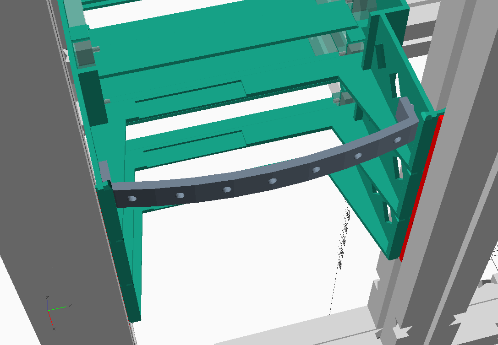
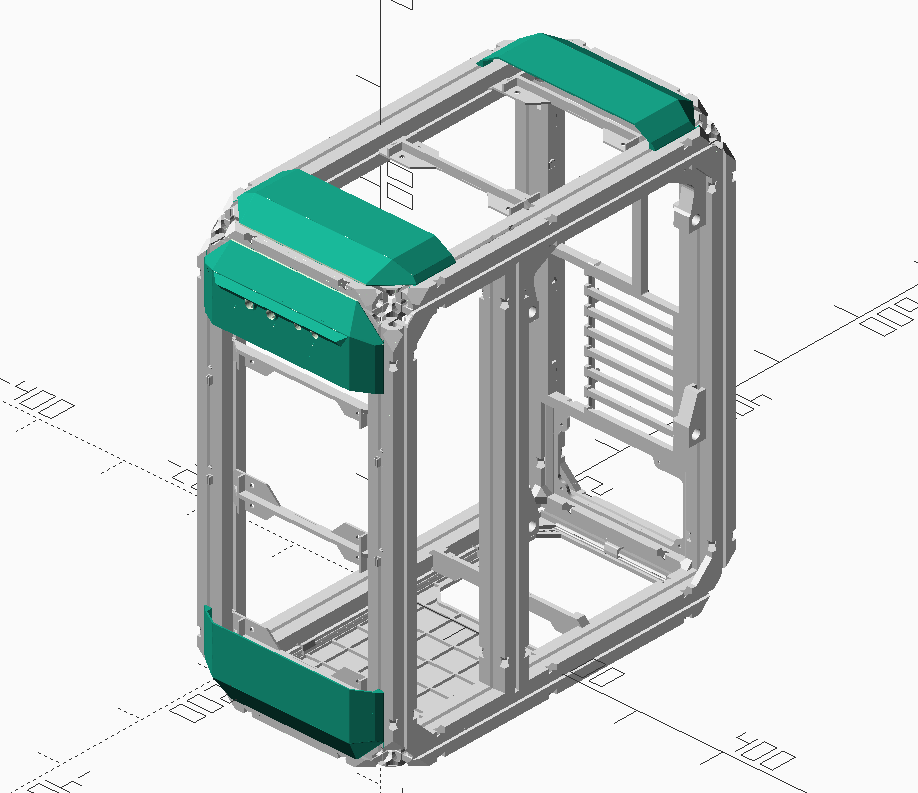

# 3D printed PC case, customizable

This is a mostly 3D printed PC case, modeled in OpenSCAD. The frame is built using [Dollo3D](https://reprap.org/wiki/Dollo) 'extention' pieces which allows for quite easy size customization. Current parts from my Dollo3D fork: https://github.com/spegelius/Dollo.

The project is quite big one so it takes time and material to build. Currently made for ATX and EE-ATX form factor (and one custom Raspberry Pi NAS/Chia mining case which is a separate project using this as base).
Currently some of the parts require quite large printer, ~300x300mm. Some of the parts are split to multiple parts to be able to print with smaller printers but for example motherboard trays are mostly big.

## Dimensions
Dimensions and orientation is shown in following picture. Parts specific for certain case size use WxDxH-notation and when certain dimension doesn't matter (for example motherboard back plate doesn't care about depth), the dimension is omitted (WxH motherboard back plate example).

## Sizes
Note that the 30x30mm Dollo3D frame pieces makes the  case bit bigger than regular case would be.

Currently following sizes are implemented:
- 230x430x480: ATX case, probably the smallest possible ATX case to build.
- 230x500x520: ATX case, has extra room for watercooling radiator (360).
- 240x540x525: EE-ATX case for SuperMicro server motherboard. Not sure if the EE-ATX spec is a standard...
- 240x540x550: EE-ATX case for SuperMicro server motherboard. Not sure if the EE-ATX spec is a standard...

Other sizes:
- 315x520x520: WIP ATX case, intended to house 2x360 radiators. No ETA if this will become reality ever...
- 218x400x400: special case made for Raspberry Pi NAS/Chia mining. Full Implemented in spearate project.

### Size customization
To create a case with size not listed above, the easiest way is to contact me. However, creating the size specific parts is quite straightforward, but does require some OpenSCAD experience.

I recommend copying one of the case_WxDxH.scad files and modifying the dimensions there to see how it works out.
Use following files to check and generate needed files:
- cover.scad
- motherboard.scad
- fans.scad
- hdd.scad
- motherboard.scad
- psu.scad

## Printing the parts
Since Dollo3D parts use dovetail joints to attach parts together, accurate printer is practically a must. I've printed most of the parts with my Prusa MK2.5S and default PrusaSlicer profiles and all parts fit together without too much hassle.
Printing and assembling the frame should be a good test about the quality. General rule of thumb for proper fit is that you can't install the ties by hand but also doesn't require excessive force. Lightly tapping with a mallet or other tool should be enough.

### Materials to use
I have printed 5 cases and used:
- PLA for the frame
- PETG for motherboard tray and tray mounts
- PETG for the hdd mounts
- GreenTec Pro for motherboard back plate
- PLA for covers
- PLA and FlexFill 98 for feet
But these are just what I've used. AFAIK PLA does deform more than other materials so it might be better to use PETG or other stronger material for structural parts.

## Build instructions

At this point you'll need to know what size you want to build.

### Frame
Frame consists of corners and W-, D- and H-beams. Each corner part is 60mm in each dimension, so when calculating the beam lenghts and what extentions to print, deduct 120mm from the total length.
Parts are joined with bow ties and you'll need to print quite a lot of those. There's a bow_tie plate model with 20 pieces available.

### Frame: corners and W beams
Parts to print:
- 8 x frame_STL/corner.stl or frame_STL/corner_no_supports.stl
- 4 x frame_STL/extention_X.stl. The extention lenght depends of the case width; for example 230mm - 120 mm = extention_110.stl
- 32 x frame_STL/bow_tie.stl or one of it's available options

Print settings:
- 2 or 3 perimeters
- ~20% infill
- 0.2-0.25mm layer height. For corners variable layer height is a good option.

I suggest to print one corner, one extention and 4 bow_ties and trying how well the parts fit together. The bow_ties should take moderate amount of force to insert to the corer and extention dovetail holes. A good fit is when you can't quite push the bow tie in by hand but lightly tapping with small mallet or other tool does the trick. This guideline works with most of the tie-joints.

Assemble 4 units as shown:

### Frame: D beams
The target is to create total of 4 x D-beams (lenth is total Depth - 120mm). 2 of those beams use the extention_t models so reduce 140mm.
So for example when depth is 430mm, the D-beam length is 310mm for 2 beams. This can be printed in one piece (extention_310.stl) or in any combination of the available extentions.
For the remaining 2 beams, when depth is 430mm, the D-beam length is 310mm - 140mm = 170mm. There's extention_t_155.stll availbale too, just adjust the calcutations accordingly.

Parts to print:
- 2 x frame_STL/extention_t_140.stl, with or without supports.
- x amount of frame_STL/extention_X.stl. 
- 40+ x frame_STL/bow_tie.stl or one of it's available options. Depends on how many extentions are printed. Print lots, you'll need these in later steps in any case...

Print settings:
- 2 or 3 perimeters
- ~20% infill
- 0.2-0.25mm layer height. For extention_t, variable layer height is a good option.
 
After printing, first assemble the extention_t parts to corners as shown:

Next, assemble the rest of the extention-parts as shown:

### Frame: H beams
Like in previous step, the length of the H beams is calculated by deducting 120mm from the total height. We'll need 5 H-beams to complete the frame.
For height of 480mm, the beam length is 360mm. 3x120mm extentions is a good choice.

Parts to print:
- x amount of frame_STL/extention_X.stl. If printing the 120mm extentions, that is 15 x.
- 40 or more x frame_STL/bow_tie.stl or one of it's available options. With 15 x 120mm extentions, total is 80 bow_ties.

Print settings:
- 2 or 3 perimeters
- ~20% infill

The assembly should be strainghtforward at this point. I suggest assembling the beams first, then connecting them to either of the parts assembled in previous steps and then topping the frame with last part.

### Frame: optional reinforcement
This step is optional but might be required with the larger cases. It can also be done later without needing to tear down the case. Personally I noticed bit of sagging on the larger cases after half a year or so. Might be due to PLA, but plastic is plastic. And the server hw + 10+ HDDs do weight some...
Anyways the trick is to use 8mm threaded rods and M8 nuts to reinforce D- and H-beams. As you may have noticed, the extention and corner parts have 8mm hole for this.
You'll need to cut the threaded rods to proper length. Deducting ~40mm of the D and H lengths should be ok.
Do not overtighten since it can break the plastic and also affect the dimensions.
You can also use M6 or M5 threaded rods, but you'll need to use adequate washers and print spacers to fill the extention hole properly.

### PSU mounts
In this section we'll print and install the ATX PSU mount parts. If you have the actual PSU meant for this case in hand, it helps when positioning the PSU support beam but that can be done when actually installing the PSU.
The PSU shouldn't be installed yet since we need to build the rest of the case first.

Parts to print:
- 1 x PSU_STL/PSU_plate_mount_1.stl
- 1 x PSU_STL/PSU_plate_mount_2.stl
- 2 x PSU_plate_long_tie_bottom.stl
- 4 x PSU_plate_long_tie.stl
- 1 x PSU_STL/PSU_backplate_W.stl. Use one that matches the case width
- 1 x PSU_STL/PSU_bottom_support_W.stl. Use one that matches the case width
- 2 x PSU_STL/PSU_bottom_support_long_tie.stl

Print settings:
- PETG or ABS recommended
- 3 perimeters
- 20+% infill

Print all the parts. Assembly requires that the dove joints fit properly, not too tight or loose. The long_tie models are printed facing the print bed so first layer calibration plays a big part.
However, if the parts are too tight, you can use file to slim them down.

First step is to install the plate mounts with the long_ties. Blue: PSU_plate_long_tie_bottom, red: PSU_plate_long_tie. Note the plate mount orientation. Plate mount long ties can be inserted from top and bottom since the frame corner has a tie hole. Use a falthead screwdriver or similar thing to help tapping the tie in place.

Next add the PSU_backplate by sliding it in from top:

After this, insert the PSU_bottom_support part as shown. It can be rotated into place. Use the PSU_bottom_support_long_ties to lock it in place. The position of the support part can be adjusted when PSU is installed.

### Motherboard tray
In this section we will print and install motherboard tray and it's mounts.
Note about parts that end with _28: these parts are only used with the 230x500x520 case. The number 28 means 28mm extra offset for the motherboard from top of the case. The extra offset is needed so that weatercooling radiator fits the case.
Note about the reinforced tray screw: since the tray screws aren't taking the full weight of the motherboard and other components, the regular screw should be enough. But I'll leave that decision (and responsibility) up to whoever builds this... :)

Tray to print (ATX):
- 1 x motherboard_STL/motherboard_tray_atx_D.stl. Use one that matches the case depth. Currently requires 300x300mm print bed.

Tray to print (EE-ATX):
- 1 x motherboard_STL/motherboard_tray_ee_atx_D.stl. Only 540mm case depth available. Requires 350x350mm print bed or use the split files (motherboard_tray_ee_atx_x_x_540)

Rest of the parts to print:
- 1 x motherboard_STL/motherboard_tray_mount_1.stl
- 1 x motherboard_STL/motherboard_tray_mount_2.stl
- 1 x motherboard_STL/motherboard_tray_mount_top_1.stl (or motherboard_tray_mount_top_1_28.stl)
- 1 x motherboard_STL/motherboard_tray_mount_top_2.stl (or motherboard_tray_mount_top_2_28.stl)
- 4 x motherboard_STL/motherboard_tray_screw.stl or reinforced version. The reinforced version has a hole for M3 screw and nut so it is stronger.
- 16 x motherboard_STL/motherboard_tray_long_bow_tie_half.stl

Hardware:
- M3 nuts for each motherboard mount stud

Print settings:
- PETG or ABS recommended (PLA ok for the bow ties)
- 3 perimeters or more. The parts are holding the motherboard so suggest making them tough.
- 30% infill or more
- variable layer height should help getting the threads printed properly.

After printing the tray, use 3mm drill bit to clean the motherboard mount holes. Then use M3 screw to pull M3 nuts in from the bottom of the tray.
Print the tray screws and check that the threads work properly. If you printed the reinforced screws, pull a M3 nut in with a m3 screw. You might need to cut the screw to proper length.

Tray mounts are attached to the frame with the motherboard_tray_long_bow_tie_half-parts. Two halves makes one bow tie. Like previously mentioned, the ties shouldn't be too tight or too loose. In case of too tight, file the parts so that the fit is good and the parts have enough friction to stay in place.
The top tray_mount_top parts obviously go to top and should be installed first. Lower tray_mounts need to be positioned with the help of the tray so install them to approximate position and then mount the tray top top mounts with the tray screws. Do not tighten the tray screws too much. After the tray is mounted, move the lower mounts to position.

Remove the tray after installing the mounts and checking that all tray screws fit properly.

### Motherboard back plate
This section details motherboard back plate installation.

Plate to print (ATX):
- 1 x motherboard_STL/motherboard_back_plate_W_H.stl (motherboard_back_plate_230_520_28.stl for case with watercooling). Requires 330mm print area, no split model available at the moment.
- 1 x motherboard_STL/motherboard_io_cover_W.stl (motherboard_io_cover_W_28.stl for case with watercooling).
- 1 x motherboard_STL/motherboard_card_cover_W_H.stl

Plate to print (EE-ATX):
- 1 x motherboard_STL/motherboard_back_plate_ee_atx_W_H.stl. Requires ~400mm print area, no split model available at the moment.
- 1 x motherboard_STL/motherboard_io_cover_ee_atx_W.stl
- 1 x motherboard_STL/motherboard_card_cover_ee_atx_W_H.stl

Rest of the parts to print:
- 9 x motherboard_STL/motherboard_back_plate_clip.stl
- 9 x motherboard_STL/motherboard_back_plate_clip_long_tie_half.stl

Print settings:
- ABS or other material that can handle high temperatures for the plate. GreenTec Pro claims 160 C and doesn't warp like ABS. I've printed mine with that, so far so good.
- PETG should work fine for the clips
- 2 or 3 perimeters
- 20+% infill
- 0.2 - 0.25mm layers

First print the plate and covers. Install the covers to see if they fit properly. The io-cover can be installed multiple ways so pick one that works for you.
Then print couple the plate clips and see if they fit on the plate dove holes. The fit should be quite tight so the plate stays in place. If the clip is too loose, there's 1.02x.stl variant.
After printing rest of the clips, install them to the frame with the long ties as shown. Start at the top middle clip and use the plate for clip positioning.

Next push the back plate in from inside of the case. Make sure that the plate pushed as far as it can go on each clip position.

### Fan mounts
For front and top fans there are 120mm and 140mm adapters available. The positioning and number of fans is for you to decide. Depending of the case size you can mount 2 or 3 fans.

Parts to print:
- fans_STL/fan_mount_120mm_W.stl or fan_mount_140mm_W.stl. Select mount for correct case width. You'll need two mounts per fan.
- fans_STL/fan_mount_dual_120mm_W.stl or fan_mount_dual_140mm_W.stl. Optional mount connecting to two fans.
- fans_STL/fan_mount_dual_120_140mm_240.stl. Optional dual mount for 120mm and 140mm fans.
- fans_STL/fan_mount_m3_adapter.stl. Adapter to allows to use M3 screw to mount the fan, one needed per fan screw.
- fans_STL/fan_mount_long_tie_half.stl. 2x per fan mount needed.

Print settings:
- PLA, PETG etc. should work fine
- 2 perimeters
- 10+% infill
- 0.2mm layers

Install the mounts between front H beams and top D beams with the long ties. Use fans for positioning the mounts.
Fans can be installed now. The top fans can be installed with regular fan screws. The fans on the front however are best installed with M3 screws because HDD trays will block access to them. With M3 screws replacing the fans is way easier since one doesn't need to remove the HDD trays or fan mounts.
The M3 adapters snap in to the mounts from below.

### Hard disk mounts
Let's set up the hdd mounts. The case was originally designed to hold lot of disks but since HD mounts are single units, you can decide how many to print.

Parts to print:
- hdd_STL/hdd_mount_rails_W.stl. As many as you need and the case can take. Select mount for correct case width.
- hdd_STL/hdd_mount_long_tie_half.stl. Need 3 per one hdd_mount.
- https://www.printables.com/model/744892-antec-elevenhundred-hdd-and-ssd-rails. 2 per hdd needed.
- hdd_STL/hdd_mount_joiner.stl. Optional
- hdd_STL/hdd_mount_cable_support.stl. Optional, provides support to cables.

Print settings:
- PETG or ABS recommended due to heat
- 2 or 3 perimeters.
- 20% infill (doesn't matter much since parts are mostly wall)
- 02-03mm layers

The mounts have built-in supports and they need to be removed before use. The mounts are mounted to the frame from three points as shown, bit of bending needed. The mount height of the mounts is up to you. Use the ties to secure the mounts.

The joiner parts are optional but might add some stability of the stack. Yuo can install them after the hdd mounts are installed, just bend the mounts to create enough of a gap to get the joiner in place. Push the mounts together to lock the joiner.

The cable supports clip onto the holes on the mount walls. 

### Bottom cover
Bottom cover installation.

Parts to print:
- 1 x bottom_cover_STL/bottom_W_D.stl. Pick file matching the width and depth of your case. No pre-split model available at the moment.
- 8-10 x bottom_cover_STL/bottom_mount_clip.stl. Larger cases use more clips
- 8-10 x bottom_cover_STL/bottom_mount_clip_long_tie_half.stl. Enough for all clips

The mount clips are to be installed to the frame as shown. After this, the bottom cover can be snapped in from below.
Protip: it is possible to install two clips with the PSU bottom support part, just replace the PSU tie with the clip. However this depends on the PSU bottom support part position, the bottom clip position might not be optimal.

### Front and top covers
Front and top covers use mostly the same models. The whole cover consists of two end-parts and grill-parts on the middle. Since the grill-portion most likely too big to print as one part, there's smaller pieces available to print.
At the front the upper end part contains the buttons and leds.
End parts are available either with dovetail joints or snapfit clips. The grill parts use snapfit clips so they are easy to install and take off. I recommend using snapfit.

Parts to print (front):
- 1 x front_top_cover_STL/front_cover_end_W_80.stl or snapfit version. Pick one that maches the width of your case.
- 1 x front_top_cover_STL/front_cover_buttons_W_80.stl or 4_leds version. Pick one that maches the width of your case. The 4 leds version is made for Supermicro motherboard but you need those leds, use them.
- 1 x front_top_cover_STL/front_cover_buttons_mount.stl or the 4_leds version.
- 2 x front_top_cover_STL/cover_lens_5mm_led.stl. Should be printed with clear material.
- 2 x front_top_cover_STL/cover_button.stl. I printed in red and yellow PLA (power and reset).
- front_top_cover_STL/front_cover_grill_W_x.stl. With or without supports. Enough of these to fill the gap between end parts. The gap is: H - 180 so for 480mm case = 300mm -> 2x150mm parts.
- front_top_cover_STL/front_cover_snap_clip_left.stl. The amount depends on the end and grill parts snap slots, print enough.
- front_top_cover_STL/front_cover_snap_clip_right.stl. Same as left.stl

Parts to print (top):
- 2 x front_top_cover_STL/front_cover_end_W_80.stl or snapfit version. Pick one that maches the width of your case.
- front_top_cover_STL/front_cover_grill_W_x.stl. With or without supports. Enough of these to fill the gap between end parts. The gap is: H - 180 so for 480mm case = 300mm -> 2x150mm parts.
- front_top_cover_STL/front_cover_snap_clip_left.stl. The amount depends on the end and grill parts snap slots, print enough.
- front_top_cover_STL/front_cover_snap_clip_right.stl. Same as left.stl

Print settings:
- PLA should be fine here unless you are pumping excessive amounts of heat out through the top of the case :). PETG works for the clips.
- 2 perimeters
- 10+% infill
- 0.2-0.3mm layers. Variable layers 

Hardware for buttons and leds:
- 2 or 4 x 5mm leds. Colors up to you, I used red and green (HDD and power)
- 2 x generic endstops.
- 3 x M3 square nuts.
- 3 x M3 screws (10mm).
- wiring and connectors

Wiring will not be detailed in these instructions so you'll have to figure this out yourself. But since there is only 2 wires for each led and endstop it's not the most complicated thing. The wires need to have a proper connectors of course.
Future dev: buy [something like this](https://www.ebay.co.uk/itm/135437857987) and adapt the button cover for it.

First let's prepare the buttons cover part. Take the buttons and check that they fit. They  should move freely on the end cover button holes. If not, use a file etc. to clean the button holes.
Next, check that the lens-parts fit the cover part lens holes. These don't need to move freely but optimally they should be able to install and remove without tools.
Next, check that the leds fit the lens-parts. If not, you can try to file the leds. The fit should be such that the leds stay in. In case of too loose fit, bit of superglue should help.
Also insert the M3 square nuts in the 3 slots.

Take the buttons_mount part and drill the 3 screw holes open with a 3mm drillbit, there's a 1 layer sacrificial bridge to remove. Next, install the endstops to the 2 slots. Check the orientation from the picture below.
The endstops are locked in with a piece of filament that you slide through the mount. Bend the ends of the filament so it stays in place.

After the endstops are installed, assemble the whole button cover part by inserting the buttons and led-lenses in and screwing the mount part on with the M3 screws. Check that the buttons work by pressing them, they should click and return. You might have to experiment with bending the endstop metal lips for optimal function.

Now that the button part is ready, set it aside for a while and install the clips to the frame (front and top) as shown. The position of the clips will be adjusted when installing the cover parts.

Install the end parts. If you printed the dove joint versions, slide them in from frame ends. For snap clips, clip them on after adjusting the snap clip positions. The position of the end parts is ~10mm from the case edge. Don't worry about exact positioning, final adjustment is done after installing the grill parts.

Lastly, install the grill parts as shown. Adjust snap clips as needed and after all parts are in, adjust them so that the cover doesn't have any gaps.

